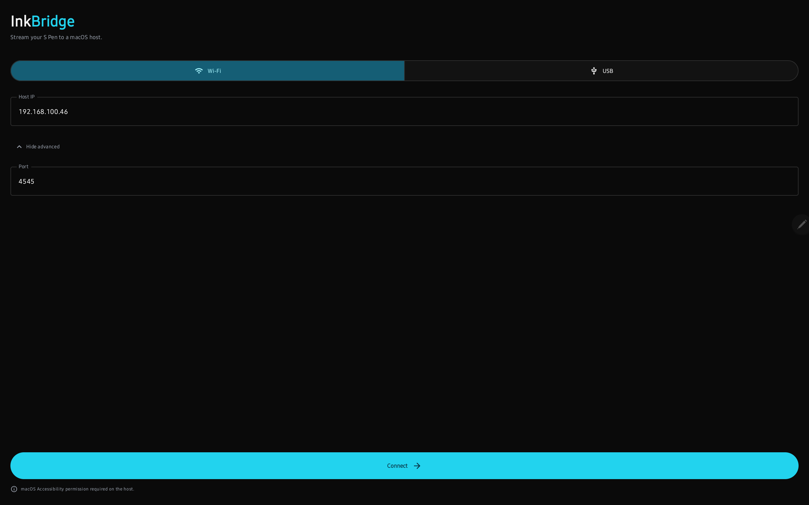
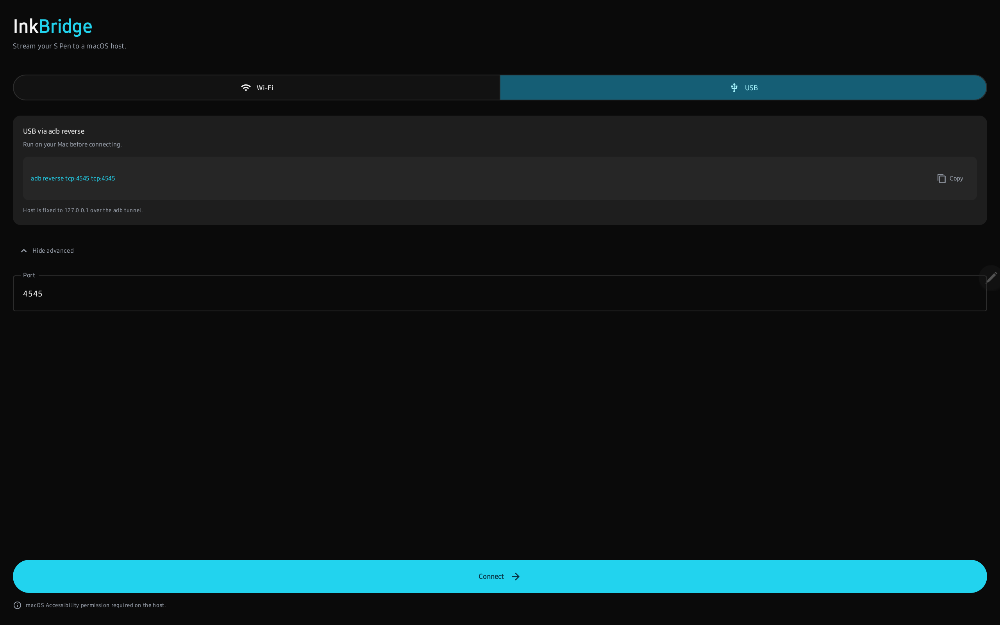
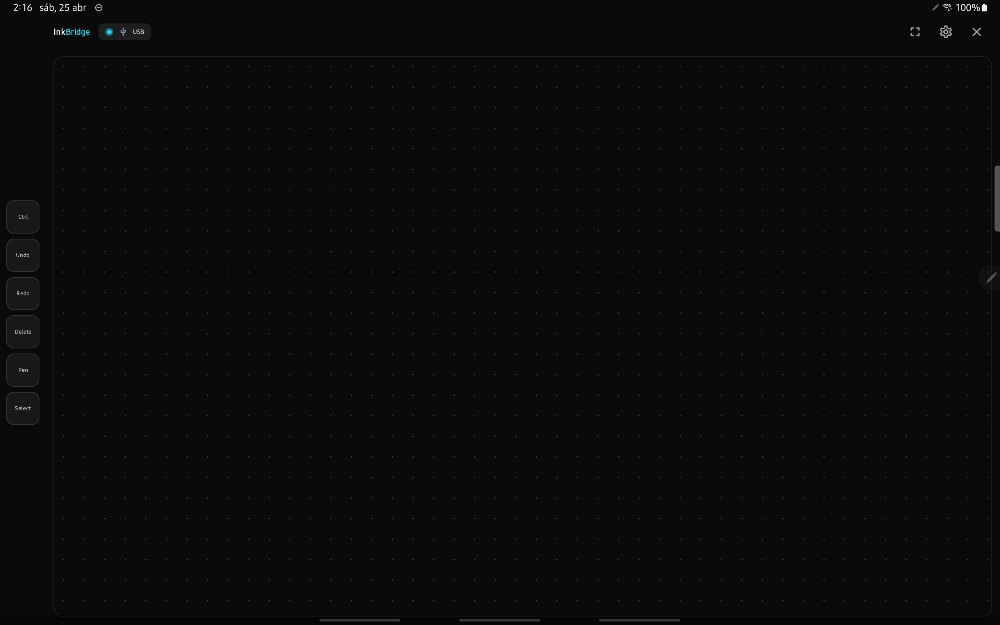
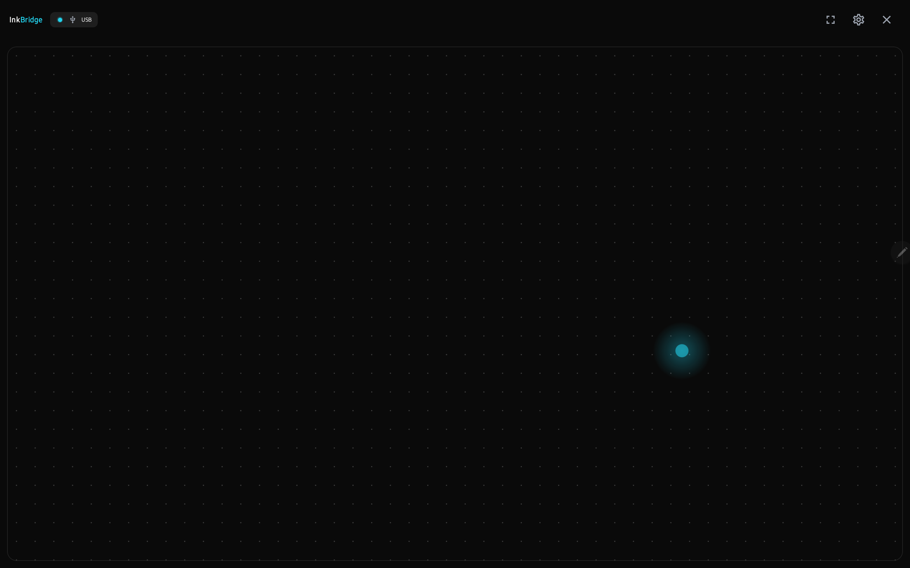
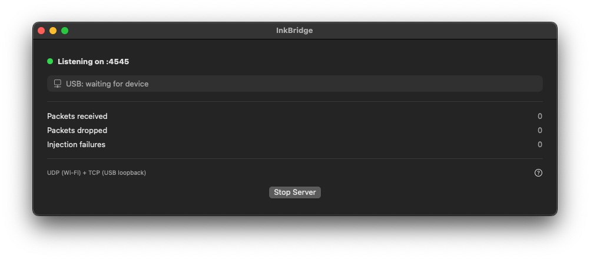
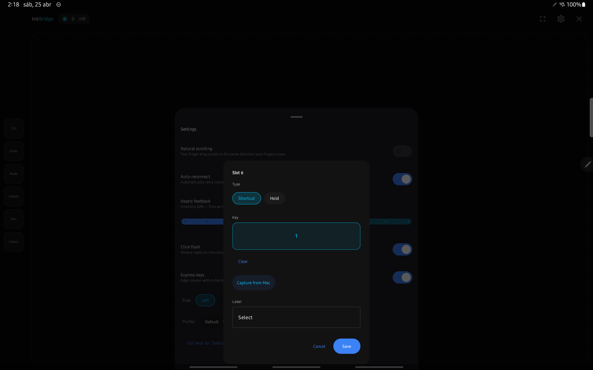
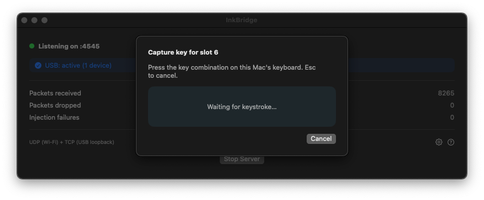

# InkBridge

Wireless drawing tablet for macOS, powered by your Android device's stylus, fingers, and an editable on-screen shortcut bar.

InkBridge captures raw S Pen events on Android (position, pressure, tilt, barrel buttons), two-finger gestures, and one-finger trackpad-style cursor moves, and streams them over Wi-Fi or USB to a macOS server that injects them as native tablet, scroll, click, **and keyboard** events. Pressure-sensitive apps — Krita, Photoshop, Affinity, Procreate-on-Sidecar — receive real brush modulation. A configurable Express Keys sidebar puts your most-used shortcuts (`⌘ Z`, `[`, `]`, modifier holds for Ctrl-pick or Space-pan) one tap away. Profiles let you switch the whole bar between e.g. Krita and Excalidraw. No driver, no kernel extension, no MDM profile.

This is a personal spike, not a product. There is no notarized installer, no auto-update, no telemetry. If something breaks, read the code.

---

## What it does

| Capability | Source on Android | Effect on Mac |
|------------|-------------------|---------------|
| Stylus stroke | S Pen tip + pressure + tilt | Native tablet event with pressure modulation in any drawing app |
| Per-app pressure curves | `PressureCurve` Bézier transform | Pressure value reshaped per frontmost app's bundle ID |
| Hover | S Pen tip near screen | Cursor moves; no click |
| Barrel button | S Pen side button | Right-click |
| 1-finger drag | One finger on canvas | Cursor delta (trackpad-style cursor move) |
| 1-finger tap | Tap and lift | Left-click at cursor |
| **Double-tap drag** | Tap, then within 350 ms put a finger back down + drag | Drag-select with primary button held — works in Finder, Excalidraw, etc. |
| 2-finger scroll | Two-finger drag | `kCGEventScrollWheel` with phase + momentum + held modifiers |
| 2-finger pinch | Two-finger zoom | `Cmd+scroll` (works in Krita, Preview, Affinity, browsers) |
| 2-finger tap | Two-finger tap | Right-click |
| **Express Keys** | Edge sidebar of 6 buttons | Per-key keyboard shortcut (`⌘ Z`, `[`, `]`...) or modifier-hold (`Ctrl`, `Cmd+Shift`...) |
| **Profiles** | Settings → Profile picker | Switch the whole 6-key bar between named configurations (Default, Krita, Excalidraw...) |
| **Capture from Mac** | Settings → Edit keys → Slot → "Capture from Mac" | Opens a modal on the Mac that captures the next physical keystroke and sends it back to the tablet |
| One-Euro position smoothing | Server-side filter on stylus X/Y | Kills sensor jitter at hover without visible lag during fast strokes |
| Latency histogram | Settings toggle in the Mac status window | Live arrival → inject percentile chart, throttled to 10 Hz |

The Mac side renders nothing visual on the canvas — it is a server: receive packets, post events, update stats. The only on-screen UI is a small status window with toggles.

---

## How it looks

### Android — connect (Wi-Fi)

The first screen picks the transport. Wi-Fi mode asks for the Mac's LAN IP. Port defaults to `4545`. The screen is locked to landscape, scrollable when the soft keyboard is open.



### Android — connect (USB via `adb reverse`)

USB mode pins the host to `127.0.0.1` and shows the exact `adb reverse` command, with a copy button. Lowest-latency path because traffic stays on-device through the USB tunnel.



### Android — capture surface with Express Keys

Once connected, the canvas takes over: dot grid, OLED black, edge-to-edge. The pill in the top-left shows the live transport (green dot = active). The cyan glow is the optional click-flash visual feedback for tap and right-click confirmations. Top-right controls: fullscreen toggle, settings, disconnect.

The **Express Keys sidebar** lives on the chosen edge (left or right) and stays full-height even on small phones. Each button can be a one-shot shortcut or a modifier-hold; profiles let you swap the whole layout at once.



### Android — capture surface (default profile)

The factory-default profile, with the click-flash animation visible on the canvas.



### macOS — server window

The Mac app is intentionally tiny: a state pill, the USB tunnel chip (which auto-runs `adb reverse` when a device is plugged in), three live counters, and a Start/Stop toggle. The settings gear opens toggles for smoothing, latency chart, and per-app pressure curves. When idle the button reads "Start Server"; when listening it reads "Stop Server".



---

## Repository layout

```
inkbridge/
├── android/                      # Kotlin + Jetpack Compose client
│   └── app/src/main/kotlin/com/inkbridge/
│       ├── data/                 # SettingsRepository (incl. profile JSON), transport sockets
│       ├── domain/               # StylusEvent, ExpressKey + ExpressKeyProfile, ConnectionState
│       ├── protocol/             # BinaryStylusCodec, MacKeyCodes lookup, KeyComboLabel
│       └── ui/screens/           # Compose UI (connection, capture, express-keys settings)
├── macos/                        # Swift Package (executable + library)
│   ├── Package.swift
│   ├── InkBridge.entitlements    # Accessibility + tablet event entitlements
│   ├── Sources/InkBridge/        # SwiftUI app (ContentView, ServerViewModel, StatusView, CaptureKeyView)
│   └── Sources/InkBridgeCore/    # Domain
│       ├── Domain/               # OneEuroFilter, PressureCurve, LatencyHistogram, LatencyTracker
│       ├── Transport/            # UDPListener, TCPListener (bidirectional, Network framework)
│       ├── Injection/            # CGEventInjector — tablet, scroll, zoom, momentum, key, drag
│       ├── Server/               # InkBridgeServer + CurveRegistry + FrontmostAppDetector
│       └── Protocol/             # BinaryStylusCodec — wire format encode/decode
├── protocol/                     # Wire-format spec + canonical test vectors (.hex)
│   ├── README.md                 # Frame layout, byte order, flags, payloads, all event types
│   └── test-vectors/             # Round-trip vectors used by both platforms' tests
├── openspec/                     # SDD artifacts (proposals, specs, design, tasks per change)
└── docs/images/                  # README screenshots
```

The protocol directory is the source of truth. Both client and server load the same `.hex` test vectors during test runs.

---

## Wire protocol (v1)

- 16-byte fixed header + variable payload, **little-endian**, no handshake.
- Same frame format on UDP (Wi-Fi) and TCP (USB loopback).
- TCP is **bidirectional** — Mac → tablet messages (capture responses) flow on the same connection.
- Sequence number is per-session and wraps at 2³². Out-of-order datagrams on UDP are dropped server-side.
- Receivers discard any unknown `event_type` rather than crashing.

| Event | Code | Direction | Total size | Use |
|-------|------|-----------|-----------|-----|
| `STYLUS_MOVE` | `0x01` | tablet → Mac | 36 B | Position + pressure + tilt |
| `STYLUS_PROXIMITY` | `0x02` | tablet → Mac | 20 B | Stylus enters/leaves hover range |
| `STYLUS_BUTTON` | `0x03` | tablet → Mac | 20 B | Barrel buttons, finger taps |
| `STYLUS_SCROLL` | `0x04` | tablet → Mac | 20 B | Two-finger scroll deltas |
| `STYLUS_ZOOM` | `0x05` | tablet → Mac | 20 B | Two-finger pinch (`Cmd+scroll` fallback on Mac) |
| `CURSOR_DELTA` | `0x06` | tablet → Mac | 20 B | One-finger relative cursor moves; emitted as `leftMouseDragged` when primary is held |
| `KEY_EVENT` | `0x07` | tablet → Mac | 20 B | Express-key shortcut tap or modifier press/release |
| `CAPTURE_REQUEST` | `0x08` | tablet → Mac | 20 B | Open the Mac key-capture modal for slot N |
| `CAPTURE_RESPONSE` | `0x09` | **Mac → tablet** | 20 B | Captured `(virtualKey, modifiers)` or cancelled flag |

Full layout, flags byte, and payload offsets in [`protocol/README.md`](protocol/README.md).

---

## Express Keys

A column of six configurable buttons that lives on the left or right edge of the canvas.

### Slot actions

Each slot is one of:

- **Shortcut** — taps fire a single keystroke combo. `keyCode` (macOS virtual keycode, position-based) + modifier bitfield (Cmd / Ctrl / Opt / Shift). Examples: `⌘ Z` (Undo), `⌘⇧ Z` (Redo), `[`, `]`.
- **Modifier hold** — touching the slot asserts the modifier(s); lifting releases. Used for "hold Ctrl + scroll = zoom", "hold Space = pan", "hold Shift = constrain stroke". `keyCode = 0` means modifier-only (Mac receives a `flagsChanged` event).

While a modifier is held on the bar, **every other event the Mac injects merges those flags** into its own. So you can hold `Ctrl` on the bar with one finger and scroll on the canvas with two — the Mac scroll event carries the Ctrl flag and the app interprets it as zoom. Same for Shift-constrained drags, Cmd-clicks, etc. The Mac tracks `heldModifiers: CGEventFlags` and applies it to scroll, mouse-move, mouse-down, key, and cursor-delta events alike.

### Profiles

Profiles are named bundles of 6 slots. Switch between them from Settings → Profile dropdown. The factory profile is "Default" with `Ctrl-hold`, Undo, Redo, Brush −, Brush +, Pan-hold. You can clone, rename, or delete any profile (the last remaining one cannot be deleted). Persisted as JSON in `SharedPreferences` under `signal.profiles[]` + `signal.profile.active`.

### Editing a slot

Tap a slot in **Settings → Edit keys**. The editor exposes:

- Type (segmented): Shortcut / Modifier hold
- Key capture box — tap to focus, then press the combo on a hardware keyboard (Bluetooth / USB-OTG) or a soft keyboard that sends raw key events (e.g. *Hacker's Keyboard*, *Unexpected Keyboard*). The Android keycode is translated to the matching macOS virtual keycode via a ~70-entry lookup table (`MacKeyCodes.kt`).
- **Capture from Mac** button — see below.
- Modifier chips (Cmd / Ctrl / Opt / Shift) when type is Hold.
- Label field — auto-filled from the captured combo (`⌘⇧ Z`), editable.

Save persists the slot in the active profile.



### Capture from Mac (bidirectional flow)

Tapping **Capture from Mac** sends a `CAPTURE_REQUEST` (event_type 0x08) over the TCP connection. The Mac receives it, presents a SwiftUI modal, installs an `NSEvent.addLocalMonitorForEvents(.keyDown)` handler, and waits. When the user presses a combo on the physical Mac keyboard, the handler captures `(event.keyCode, event.modifierFlags)` — already in macOS-native types — and sends a `CAPTURE_RESPONSE` (event_type 0x09) back over the same TCP socket. The tablet receives the response (via the read loop in `TcpStylusClient.runReadLoop`), populates the slot editor, and auto-fills the label glyphs (`⌘⇧ Z`). Esc on the Mac cancels and reports `cancelled = true` to the tablet. **No keycode translation table involved** on the Mac path — `kVK_*` flows directly. The 30-second tablet-side timeout protects against an abandoned modal.



---

## Signal quality

Three macOS-only features that improve how the stroke *feels*:

### Position smoothing (One-Euro filter)

Per-axis `OneEuroFilter` applied to STYLUS_MOVE x/y server-side, before coordinate mapping. Defaults tuned for stylus position (`minCutoff = 5.0` Hz ≈ 32 ms time constant; `beta = 0.5`): jitter killed at rest, fast strokes pass through with negligible filter contribution. Toggle in Mac settings (default ON).

### Per-app pressure curves

A `PressureCurve` is a cubic Bézier whose endpoints are pinned to (0, 0) and (1, 1); only the two interior control points are user-editable. Three presets ship: Linear (identity), Soft (lower mid-range = lighter strokes), Hard (faster ramp = heavier strokes). The `CurveRegistry` is keyed by macOS bundle identifier — Krita uses one curve, Affinity another. The frontmost-app bundle ID is cached at ~1 Hz via `NSWorkspace.didActivateApplicationNotification`, so the inject hot path stays syscall-free.

### Latency histogram

Toggle "Show latency chart" in Mac settings. Renders a live SwiftUI Chart of arrival → inject latency, refreshed at 10 Hz. Useful to diagnose "feels laggy" complaints with real numbers, and to A/B the smoothing filter on/off.

---

## Why not native pinch?

Two-finger pinch is sent as `STYLUS_ZOOM`, but the Mac translates it into `Cmd+scroll` rather than a real `kCGEventTypeGesture` (rawValue 29) `magnify` event. The native gesture path is undocumented and silently dropped by `cgSessionEventTap` for apps that lack a private Apple entitlement (`com.apple.private.gesture-events`), even with Hardened Runtime + Apple Development cert. The `Cmd+scroll` fallback works universally in apps that map that combo to zoom (Krita, Preview, Affinity, Chrome, Safari, Figma). The flag `CGEventInjector.preferGestureEvent` is reserved for the day this changes; keep it `false`.

For the same reason, synthetic mouse-button events require a proper Apple Development cert + Hardened Runtime + entitlements file. An ad-hoc signed binary will move the cursor but not click. The signing recipe is below.

---

## Build and run

### Prerequisites

- macOS 13+ with Xcode 15+ command-line tools (`swift --version` ≥ 5.9)
- Android SDK + JDK 17 (Temurin recommended)
- An Apple Development certificate in the login keychain (find the identity with `security find-identity -v -p codesigning`)
- Android device (any Android 10+; landscape orientation)
- ADB on `PATH` (the Mac app auto-discovers it; `which adb` should resolve)

### macOS server

```bash
cd macos
swift build -c release

cp .build/release/InkBridge build/InkBridge.app/Contents/MacOS/InkBridge
codesign --force --deep --options runtime \
  --entitlements InkBridge.entitlements \
  --sign "Apple Development: Your Name (XXXXXXXXXX)" \
  build/InkBridge.app

open build/InkBridge.app
```

On first launch macOS will prompt for **Accessibility** permission (System Settings → Privacy & Security → Accessibility). Without it the server runs but cannot inject events.

### Android client

```bash
cd android
JAVA_HOME=/Library/Java/JavaVirtualMachines/temurin-17.jdk/Contents/Home \
  ./gradlew :app:installDebug
```

Then launch **InkBridge** from the app drawer. The app is locked to landscape orientation.

### USB connection (recommended for lowest latency)

The Mac app auto-runs `adb reverse tcp:4545 tcp:4545` when it detects a connected device — the **USB** chip in the server window turns green. If it stays grey, run the command manually:

```bash
adb reverse tcp:4545 tcp:4545
```

Then on the Android side: pick **USB**, tap **Connect**.

### Wi-Fi connection

Make sure the phone and Mac are on the same network. Find the Mac's LAN IP (`ifconfig | grep 'inet 192'`), enter it on the **Wi-Fi** tab, tap **Connect**. Note: capture-from-Mac requires TCP (USB), not UDP — the response cannot be addressed back over Wi-Fi UDP without a tracked remote.

---

## Tests

Both platforms run tests entirely in-process — no real sockets, no real ADB, no real `CGEventPost`.

```bash
# macOS — 202 tests
cd macos && swift test

# Android — 215 tests
cd android && JAVA_HOME=/Library/Java/JavaVirtualMachines/temurin-17.jdk/Contents/Home \
  ./gradlew :app:testDebugUnitTest --no-daemon
```

The `protocol/test-vectors/*.hex` files are the canonical wire-format reference — both test suites round-trip them to confirm the encoder and decoder agree byte-for-byte.

---

## Latency budget

End-to-end stylus → cursor latency on USB sits around **8–14 ms** in normal operation, dominated by:

- Android batching: `MotionEvent.getHistoricalX/Y` flattened into per-sample frames, single-thread emit dispatcher.
- TCP `noDelay = true` (Nagle disabled) on both sides for the loopback path.
- macOS `MainActor` injection with a cached `AXIsProcessTrusted()` value (re-read only on app foreground; not on every frame).
- Latency tracker publishes at 10 Hz to keep SwiftUI off the hot path at 240 Hz sampling.
- One-Euro smoothing adds < 1 µs per axis per frame; pressure-curve transform < 100 ns; held-modifier merge is a flag union.

Wi-Fi adds the LAN round-trip — typically 2–5 ms on a clean 5 GHz network, much more on a saturated one.

---

## Status & limitations

- **Personal spike, not a product.** No CI, no installer, no signing automation.
- **Not notarized.** You must sign with your own Apple Development identity to inject clicks and keys.
- **No native pinch.** See above; uses `Cmd+scroll` fallback.
- **One TCP client at a time.** UDP accepts datagrams from any sender on the LAN — beware open ports.
- **Tab S7 (SM-T870) reference device.** Other Samsung tablets work; Galaxy A16 phone tested. Vibrator behavior in particular varies wildly across OEMs.
- **macOS 13+ required.** Older versions have a different scroll-phase API surface.
- **Capture from Mac requires USB (TCP).** Wi-Fi (UDP) is one-way and the response cannot be addressed back.
- **Soft keyboards that send IME insertions instead of `KeyEvent`s** (e.g. Samsung Keyboard) cannot capture combos locally on the tablet. Use Capture-from-Mac, an OTG keyboard, or a key-event-based IME like *Unexpected Keyboard*.

---

## SDD trail

Every change went through Spec-Driven Development. Proposals, specs, designs, and task lists live under [`openspec/changes/`](openspec/changes/). Notable changes:

- `foundation` — original architecture, wire protocol v1 (events 0x01–0x06)
- `signal-quality` — One-Euro smoothing, per-app pressure curves, latency histogram
- `express-keys` — KEY_EVENT 0x07 wire frame, Android sidebar UI, Mac keyboard injection
- `mac-key-capture` — bidirectional wire (CAPTURE_REQUEST 0x08, CAPTURE_RESPONSE 0x09), Mac modal capture flow

Read the proposals first — they explain *why* before *how*.

---

## License

No license declared yet. Treat as **all rights reserved** until that changes. Do not redistribute the signed `.app` bundle — the entitlements and signing identity inside it are tied to the author's developer account.
